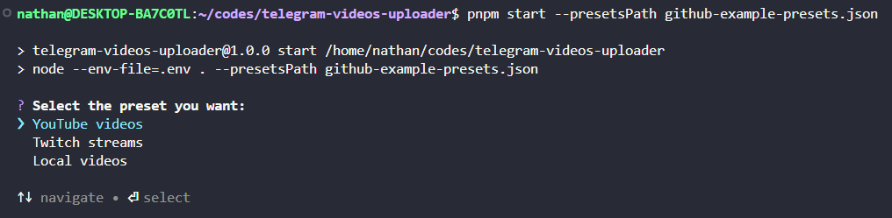
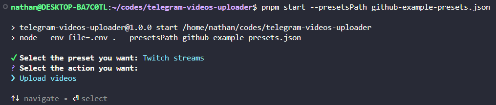
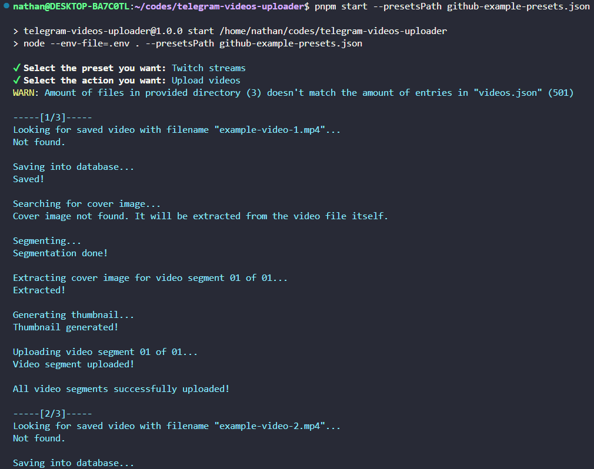

🇺🇸 You are reading the Portuguese version. [Click here to read the English version.](./README.md)

# telegram-videos-uploader
Uploader de vídeos para o Telegram usando Node.js e TypeScript.

## Imagens





## Sumário
- [Sobre o projeto](#sobre-o-projeto)
- [Configuração e Instalação -> Requisitos mínimos](#requisitos-mínimos)
- [Configuração e Instalação -> Instalação](#instalação)
- [Configuração e Instalação -> Entendendo a diferença entre servidores da `Bot API`](#entendendo-a-diferença-entre-servidores-da-bot-api)
- [Configuração e Instalação -> Variáveis de ambiente](#variáveis-de-ambiente)
- [Configuração e Instalação -> Criando o arquivo `presets.json`](#criando-o-arquivo-presetsjson)
- [Configuração e Instalação -> Subindo o servidor local da `Bot API`](#subindo-o-servidor-local-da-bot-api)
- [Uso -> Rodando o projeto](#rodando-o-projeto)
- [Uso -> Como funciona](#como-funciona)
- [Uso -> Sobre o arquivo `videos.json`](#sobre-o-arquivo-videosjson)
- [Uso -> Limitações](#limitações)
- [Contribuindo](#contribuindo)
- [Licença](#licença)

## Sobre o projeto
Este projeto é capaz de fazer o upload de vídeos para o Telegram através da `Bot API`, utilizando um bot previamente adicionado ao canal em que se deseja fazer o upload dos vídeos. Foi desenvolvido por Nathan Murillo, cujo perfil no GitHub pode ser encontrado [clicando aqui](https://github.com/NathanMBR).

## Configuração e Instalação
### Requisitos mínimos
- Node.js 24 ou superior
- pnpm 9 ou superior
- CLI do ffmpeg
- CLI do ffprobe
- CLIs do bash e do jq (necessárias somente para utilizar o script de conversão do `videos.json`; veja [nesta seção](#sobre-o-arquivo-videosjson))
- Token de um bot do Telegram + ID do canal em que os vídeos serão postados (o bot precisa ter permissão para enviar mensagens)
- Arquivo de configuração `presets.json` (veja [nesta seção](#criando-o-arquivo-presetsjson))

### Instalação
```bash
git clone https://github.com/NathanMBR/telegram-videos-uploader.git
cd telegram-videos-uploader
pnpm install
```

### Entendendo a diferença entre servidores da `Bot API`
O Telegram fornece dois modos de utilizar a `Bot API`:

1. Pelo servidor oficial (disponível através do link `https://api.telegram.org`);
2. Por um servidor local auto-hospedado.

O servidor oficial não requer certas configurações que seriam necessárias para o local, mas em contrapartida possui limites de upload curtos (cerca de 50 MB para vídeos). Um servidor local possui limites bem maiores (2000 MB), mas requer o registro de uma aplicação no Telegram e a obtenção de um ID e de um hash de API. Felizmente, este repositório conta com um arquivo [`compose.yml`](./compose.yml) que pode ser utilizado para subir rapidamente um servidor auto-hospedado utilizando Docker Compose, bastando apenas fornecer as variáveis de ambiente necessárias (verificar [a seção abaixo](#variáveis-de-ambiente)).

Você pode ver mais sobre os benefícios de um servidor de API auto-hospedado [clicando neste link](https://core.telegram.org/bots/api#using-a-local-bot-api-server), e entender como registrar a aplicação e obter as informações necessárias [clicando neste outro link](https://core.telegram.org/api/obtaining_api_id).

### Variáveis de ambiente
Você pode copiar o arquivo de exemplo `.env.example` e substituir com os valores que possui:

```bash
cp .env.example .env
```

Tabela com as variáveis de ambiente disponíveis:

| Variável | Obrigatória? |  Descrição |
|---|---|---|
| `TELEGRAM_API_ID` | Não | ID de API do Telegram* |
| `TELEGRAM_API_HASH` | Não | Hash de API do Telegram* |

> **\*Nota:** Obrigatório se você for utilizar o servidor local da `Bot API` pelo Docker Compose.

> **Nota:** A localização do banco de dados **não** é uma variável de ambiente: ela é definida por preset através da propriedade `databaseUrl` dentro do arquivo `presets.json` (veja [nesta seção](#criando-o-arquivo-presetsjson)). Caso você não pretenda utilizar o servidor local da `Bot API`, o arquivo `.env` não é necessário.

### Criando o arquivo `presets.json`
Você também pode copiar o arquivo de exemplo [`presets.example.json`](./presets.example.json) e substituir com os valores que possui:
```bash
cp presets.example.json presets.json
```

Exemplo com comentários:
```jsonc
[
  {
    "name": "Meu Preset", // Nome do preset, utilizado na seleção de presets
    "origin": "qualquer-coisa", // (Opcional) Identificador qualquer, útil quando você tem mais de um preset e deseja diferenciar os dados no banco de dados
    // URL do banco de dados SQLite utilizado por este preset, no formato "file:nome-do-arquivo.db"
    // Caminhos relativos são resolvidos a partir do diretório em que o comando for executado; também é possível utilizar um caminho absoluto ("file:/caminho/para/database.db")
    // Cada preset pode apontar para o seu próprio arquivo de banco de dados, e o arquivo (junto de suas tabelas) é criado automaticamente caso ainda não exista
    "databaseUrl": "file:database.db",
    "telegram": {
      // URL base da API para o upload dos vídeos
      // Caso necessário, troque para o endereço do servidor local da Bot API rodando no Docker Compose
      "apiBaseUrl": "https://api.telegram.org",
      "botToken": "0000000000:XXXXXXXXXXXXXXXXXXXXXXXXXXXXXXXXXXX", // Token do BOT do Telegram
      "channelId": "-100XXXXXXXXXX" // ID do canal em que os vídeos serão postados
    },
    "videosDirectory": "/diretorio/dos/videos", // Diretório onde os seus vídeos estão
    "postDescription": {
      // (Opcional) O texto base que será publicado junto com o vídeo, que pode ser um array de strings (como abaixo) ou uma string única
      // Caso seja um array, as strings são concatenadas com quebra de linha (\n)
      // O texto suporta MarkdownV2 (como pode ser visto na linha que começa com "Título"), mas não é obrigatório utilizá-lo
      "baseText": [
        "Título: #VIDEO_TITLE", // Isso faz o texto do placeholder #VIDEO_TITLE ser clicável e direcionar para o link do placeholder #VIDEO_URL
        "Descrição: #VIDEO_DESCRIPTION",
        "Canal: [#CHANNEL_TITLE](#CHANNEL_URL)", // A mesma coisa do título se aplica aqui
        "Disponibilidade: #AVAILABILITY",
        "Publicado em: #DATE",
        "Parte: #PART_CURRENT de #PART_TOTAL"
      ],

      "channel": {
        "name": "My Channel [Twitch]", // (Opcional) Nome do canal de onde o vídeo saiu, que será substituído no placeholder #CHANNEL_TITLE
        "url": "https://www.twitch.tv/mychannel" // (Opcional) Link do canal de onde o vídeo saiu, que será substituído no placeholder #CHANNEL_URL
      },

      // (Opcional) Formato da data do placeholder #DATE
      // "DD" significa "dia", "MM" significa "mês" e "YYYY" significa "ano"
      // Verifique o arquivo "Preset.ts" dentro do diretório "./src/domain" para verificar todos os formatos disponíveis
      "dateFormat": "MM/DD/YYYY",

      // (Opcional) Mapeamento dos estados de disponibilidade possíveis
      // O estado "unknown" é utilizado quando o vídeo não possui disponibilidade definida no arquivo videos.json
      "availability": {
        "private": "Privado",
        "premiumOnly": "Somente para usuários do YouTube Premium",
        "subscriberOnly": "Somente para membros do canal / subs",
        "needsAuth": "Público (requer login)",
        "unlisted": "Não-listado",
        "public": "Público",
        "unknown": "Desconhecido"
      }
    }
  }
]
```

O arquivo `presets.json` é carregado automaticamente caso esteja no diretório raiz do projeto. Caso queira salvá-lo com um nome ou em um diretório diferentes, você pode apontar o caminho do arquivo com uma flag ao rodar o comando. Verifique essa opção [na seção abaixo](#rodando-o-projeto).

> **AVISO:** O arquivo `presets.json` deve ser salvo sem nenhum comentário.

### Subindo o servidor local da `Bot API`
Após confirmar que as variáveis de ambiente estão corretamente inseridas, basta rodar o comando abaixo:
```bash
sudo docker compose up -d
```

## Uso
### Rodando o projeto
```bash
# Uso padrão: build + start
pnpm build
pnpm start

# Para uso rápido
pnpm dev

# Apontando para um arquivo presets.json diferente
pnpm start --presetsPath /new/path/to/presets.json
pnpm start -p /new/path/to/presets.json

# Dry run
pnpm start --dryRun
pnpm start -d
```

Tabela com as flags disponíveis:

| Flag | Atalho | Tipo | Padrão | Descrição |
|---|---|---|---|---|
| `--presetsPath` | `-p` | Texto | `presets.json` no diretório onde o comando é rodado | Caminho do arquivo `presets.json` |
| `--dryRun` | `-d` | Booleano | `false` | Roda a ação de upload sem persistir informações no banco de dados ou fazer o upload de vídeos |

### Como funciona
O código lê o conteúdo do arquivo `presets.json` presente na raiz do projeto para obter suas configurações. A partir daí, pede primeiramente ao usuário para selecionar um dos presets providos pelo arquivo. Logo após a seleção, conecta-se ao banco de dados definido na propriedade `databaseUrl` do preset e aplica as migrations pendentes automaticamente (criando o arquivo do banco de dados caso ele ainda não exista), e depois pede para selecionar uma ação.

As ações disponíveis são:

- **Upload de vídeos:** lê os dados dos vídeos do arquivo `videos.json` dentro do diretório de vídeos do preset (caso exista) para utilizar como referência. Então, o vídeo é dividido em segmentos menores que (ou iguais a) 1.75GB de tamanho, a _cover image_ é convertida para _thumbnail_ caso já exista ou extraída do próprio vídeo caso contrário, e o upload do vídeo é feito para o canal do Telegram.

- **Checagem dos dados do preset:** não faz nenhum upload. Imprime as principais configurações do preset escolhido (nome, origem, banco de dados, diretório de vídeos, nome do canal, URL do canal e formato de data) e depois consulta a `Bot API` do Telegram para imprimir os dados do canal (título e descrição) e do bot (nome e nome de usuário) para os quais o preset realmente aponta. É útil para confirmar que o token do bot, o ID do canal e a URL da API estão corretos antes de iniciar um upload.

Quando a flag `--dryRun` (`-d`) é informada, a ação de upload não persiste dados no banco de dados nem faz o upload de nenhum vídeo.

### Sobre o arquivo `videos.json`
O arquivo `videos.json` define as informações do vídeo que serão utilizadas para a postagem do mesmo no canal do Telegram, como título, URL, dentre outras. Ele deve sempre ser salvo com esse nome, no mesmo diretório que foi informado no preset que você estiver utilizando. O formato dele é de um array de objetos contendo as seguintes propriedades:

| Propriedade | Tipo | Descrição |
|---|---|---|
| `title` | Texto | O título do vídeo |
| `filename` | Texto | O nome do arquivo do vídeo |
| `description` | Texto | A descrição do vídeo |
| `webpage_url` | Texto | A URL do vídeo |
| `availability` | Enum | A disponibilidade do vídeo; pode ser `public`, `private`, `unlisted`, `needs_auth`, `premium_only` ou `subscriber_only`
| `upload_date` | Texto | A data de upload do vídeo, no formato `YYYY-MM-DD`

Caso você utilize a ferramenta [`yt-dlp`](https://github.com/yt-dlp/yt-dlp) para baixar vídeos de um canal do YouTube, pode gerar o arquivo `videos.json` através dela e [do script `convertYtdlpJsonToVideosJson.sh`](./scripts/convertYtdlpJsonToVideosJson.sh), localizado no diretório `scripts`. Primeiramente, utilize o comando abaixo:
```bash
yt-dlp -J https://youtube.com/channel-link > ytdlp.json
```

> **Nota:** Caso precise baixar vídeos restritos a assinantes do sistema de membros de um canal, verifique [este tutorial do `yt-dlp` sobre exportação de cookies](https://github.com/yt-dlp/yt-dlp/wiki/Extractors#exporting-youtube-cookies). Para funcionar, você precisará ter ao menos uma conta que possui a assinatura.

Após gerar o arquivo temporário `ytdlp.json`, utilize o script de conversão mencionado acima, inserindo o caminho do arquivo temporário no lugar devido:
```bash
./scripts/convertYtdlpJsonToVideosJson.sh /caminho/para/ytdlp.json
```

O script é um script em bash e depende da CLI do [`jq`](https://jqlang.org) estar disponível no seu `PATH`.

O arquivo gerado será salvo na mesma pasta em que `ytdlp.json` está, com o nome `videos_<timestamp>.json` (o timestamp evita sobrescrever uma conversão anterior). O script imprime o caminho completo dele ao final. Após isso, você pode deletar o arquivo temporário. Não esqueça de renomear o arquivo gerado para `videos.json` e, caso necessário, de movê-lo para a pasta especificada no preset a ser utilizado dentro do arquivo `presets.json`.

Caso deseje, também é possível escrever manualmente o arquivo `videos.json`, embora isso seja um processo trabalhoso.

> **Nota:** o arquivo `videos.json` não é necessário para que o upload funcione, mas apenas a mínima informação necessária será provida para tal. A maioria dos _placeholders_ da descrição do post ficarão vazios.

### Limitações
- Caso seus vídeos sejam muito grandes, não será possível utilizar a API padrão do Telegram, sendo necessário subir seu próprio servidor para o upload. Verifique a seção ["Entendendo a diferença entre servidores da `Bot API`"](#entendendo-a-diferença-entre-servidores-da-bot-api) para saber mais sobre.

- Até o presente momento, este projeto é capaz de lidar apenas com vídeos no formato `.mp4` e _cover images_ nos formatos `.jpg` e `.jpeg`. Caso seus arquivos não estejam nesses formatos, converta-os antes.

> **Nota:** Você pode fazer essa conversão utilizando [o script `convert_webm_and_mkv_to_mp4.sh`](./scripts/convert_webm_and_mkv_to_mp4.sh), localizado no diretório `scripts`; basta executá-lo dentro do local em que os seus vídeos estão salvos. Se você utiliza uma placa de vídeo **NVIDIA** com suporte **CUDA**, utilize [o script `nvidia_convert_webm_and_mkv_to_mp4.sh`](./scripts/nvidia_convert_webm_and_mkv_to_mp4.sh) ao invés disso.

## Contribuindo
Você pode sugerir mudanças para o projeto abrindo uma issue [na página do projeto no GitHub](https://github.com/NathanMBR/telegram-videos-uploader). Pull requests são bem-vindos.

## Licença
[MIT](./LICENSE)
